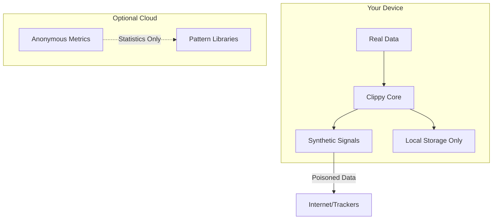

# 📎 Clippy: Your Personal Data Assistant

> "It looks like the surveillance economy is extracting $8,000+ per year from you. Would you like help extracting it back?"

[](https://www.gnu.org/licenses/agpl-3.0)
[](https://discord.gg/clippy)
[](https://getclippy.dev/docs)

## 🎯 Mission

Clippy is an open-source personal data assistant that turns the surveillance economy against itself. Instead of hiding from trackers, we poison their data. Instead of accepting exploitation, we extract value back. Instead of being the product, we make surveillance expensive and unreliable.

**We don't just protect your privacy—we make privacy profitable.**

## ✨ Features

### 🎭 **Synthetic Personas**
Generate believable alternate identities that browse alongside you, making your real behavior statistically invisible in the noise.

### 💰 **Value Extraction** 
Automatically identify and claim:
- Class action settlements you're entitled to
- GDPR/CCPA compensation
- Data broker opt-out bounties
- Refunds when services change their terms
- Hidden cashback opportunities

### 🎯 **Adversarial Poisoning**
Every fake click costs advertisers money. Every poisoned data point degrades their models. We make tracking more expensive than not tracking.

### 📊 **Real-time Transparency**
See exactly what's being collected, its estimated value, and what 2,847 companies think they know about you.

### 🤖 **AI Negotiation**
Clippy monitors Terms of Service changes, negotiates better privacy settings, and alerts you when companies try to retroactively alter what you paid for.

### 🔄 **Profile Optimization**
Strategically present different versions of yourself to get better rates on insurance, credit, and services. Game the system that's gaming you.

## 🚀 Quick Start

### Self-Hosted (Recommended)

```bash
# Clone the repository
git clone https://github.com/getclippy/clippy.git
cd clippy

# Configure your instance
cp .env.example .env
# Edit .env with your preferences

# Run locally
nix run

# Or deploy with Docker
docker-compose up -d
```

### Managed Service

For those who prefer convenience over control:

1. Visit [getclippy.dev](https://getclippy.dev)
2. Create an account (no personal info required)
3. Install the browser extension
4. Watch Clippy go to work

## 🏗️ Architecture



**Zero-Knowledge Design**: Your real data never leaves your device. We can't see it, sell it, or lose it to hackers because we never have it.

## 📦 Components

### Core Modules

- **`clippy-core`** - Main processing engine (Rust/WASM)
- **`clippy-personas`** - Synthetic identity generator
- **`clippy-poison`** - Adversarial signal injection
- **`clippy-extract`** - Value recovery automation
- **`clippy-monitor`** - Real-time tracking detection

### Browser Extensions

- **Chrome/Edge** - Manifest V3 compatible
- **Firefox** - Full WebExtensions API support
- **Safari** - Native iOS/macOS extension

### Platform Integrations

- **Desktop** - Electron app for system-wide protection
- **Mobile** - React Native apps (iOS/Android)
- **Router** - OpenWRT package for network-level deployment

## 🛠️ Development

### Prerequisites

- Node.js 18+ 
- Rust 1.70+ (for core modules)
- Docker (optional, for containerized development)

### Building from Source

```bash
nix build
```

### Contributing

We welcome contributions! Please see our [Community Guide](COMMUNITY.md) for details.

## 🗺️ Roadmap

### Phase 1: Foundation (Aug-Oct 2025)
- [x] Core transparency engine
- [x] Basic persona generation
- [ ] Initial value extraction for settlements
- [ ] Browser extension MVP

### Phase 2: Intelligence (Nov 2025 - Jan 2026)
- [ ] Advanced AI agent integration
- [ ] Automated adversarial operations
- [ ] Profile optimization algorithms
- [ ] ToS change detection

### Phase 3: Network Effects (Feb-Apr 2026)
- [ ] Peer-to-peer persona sharing
- [ ] Decentralized noise generation
- [ ] Shared pattern libraries
- [ ] Community poisoning campaigns

### Phase 4: Ecosystem (May-Jul 2026)
- [ ] Plugin marketplace
- [ ] Third-party integrations
- [ ] Enterprise features
- [ ] Mobile-first redesign

## 💡 Use Cases

### For Individuals
- Recover $50-200/month in value you're already owed
- Reduce targeted manipulation and price discrimination
- Protect against government mass surveillance
- Maintain multiple online identities effortlessly

### For Researchers
- Study surveillance capitalism with real data
- Test privacy-preserving technologies at scale
- Contribute to adversarial ML research
- Analyze tracking ecosystem behavior

### For Activists
- Coordinate privacy campaigns
- Share effective poisoning strategies
- Document surveillance overreach
- Build resistance networks

## 🔒 Security & Trust

### Warrant Canary System
Even if we're compromised and legally gagged, multiple fail-safes protect you:

- **Blockchain Dead Man's Switch**: Smart contract requiring monthly updates or clients auto-disable
- **Multi-Signature Verification**: 2-of-3 distributed team members must sign daily
- **Community Monitors**: Independent nodes verify our integrity 24/7
- **Automatic Lockdown**: Clients protect themselves if any canary fails

### Legal Structure
Multi-jurisdictional design with no single point of failure:

- 🇮🇸 **Iceland Foundation**: Non-profit holding IP and governance
- 🇨🇭 **Swiss Operations**: Service management with strong privacy laws
- 🇪🇪 **Estonian Development**: Technical team with EU protections
- 🌐 **Community DAO**: Decentralized governance and oversight

### Verification
```bash
# Check canary status
clippy canary check --all

# Verify code integrity
clippy verify --deep

# Emergency lockdown
clippy lockdown --permanent
```

**Monitor Dashboard**: [monitor.getclippy.dev](https://monitor.getclippy.dev)
**Blockchain Canary**: `0x[CONTRACT_ADDRESS]`
**Emergency Channel**: `#clippy-emergency:matrix.org`

## 🔒 Security

- **AGPL-3.0 Licensed** - Ensures the code stays open
- **Local-First** - Your data stays on your device
- **E2E Encrypted** - When sync is enabled
- **No Analytics** - We don't track our users (ironic, right?)
- **Reproducible Builds** - Verify binaries match source
- **Regular Audits** - Community-funded security reviews

## 📊 Impact (Year 1 Goals)

- 🎯 **10,000+** Active Users
- 💰 **$1.2M** Recovered for Users  
- 🤝 **500+** Contributors
- 📉 **30%** Reduction in Tracking Accuracy
- 🚫 **$10M** in Wasted Ad Spend

## 🌍 Deployment

Clippy is strategically incorporated in **Iceland** with development nodes in **Switzerland** and **Estonia**—jurisdictions with strong privacy protections and resistance to surveillance overreach.

## 📚 Documentation

- [Quick Start](https://getclippy.dev/docs#quick-start)
- [Developer Docs](https://getclippy.dev/docs#developers)
- [API Reference](https://getclippy.dev/docs#api)
- [Security Model](https://getclippy.dev/docs#security)
- [FAQ](https://getclippy.dev/docs#faq)

## 💬 Community

- **Discord**: [discord.gg/clippy](https://discord.gg/clippy)
- **Matrix**: [#clippy:matrix.org](https://matrix.to/#/#clippy:matrix.org)
- **Forum**: [forum.getclippy.dev](https://forum.getclippy.dev)
- **X**: [@getclippy](https://x.com/getclippy)

## ⚖️ Legal

This software is provided for educational and research purposes. Users are responsible for complying with their local laws and service agreements. Clippy helps users exercise existing rights under GDPR, CCPA, and similar regulations.

## 🤝 Sponsors

This project is funded by:
- Individual contributors
- Privacy-focused foundations
- Ethical technology grants
- User subscriptions (optional managed service)

**We will never accept funding from surveillance companies, data brokers, or government agencies.**

## 📜 License

Clippy is licensed under the [GNU Affero General Public License v3.0](LICENSE).

This ensures Clippy remains free, open, and immune to corporate capture.

---

<p align="center">
  
  <br>
  <i>"I'm here to help!"</i>
  <br>
  <b>Your data. Your rules. Your profit.</b>
</p>

---

*Remember: The best defense against surveillance is making it expensive, unreliable, and unprofitable.*

*Join us in breaking the panopticon, one poisoned click at a time.*
